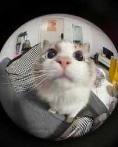

# Hello I am Nivedh, nice to meet you!!!

# My Coding works/experience.

My full name is Nivedh Mahesh Nair, I was born in Kerala - India. I am an ametuer - coder who started to give coding an intrest recently. I have done a handful amount of projects in languages like scratch, html/css and python. The projects I have done include :

- ### Scratch: A short game - a short video.
- ### Html/Css: [A website for a cafe.](https://nivedh-scammer.github.io/year-10-website/)
- ### Python: A chatbot.

#

# My intrest for coding.

The reason I wanted to study Digi tech was because I wanted to learn more about web development and I am intrestedin becoming a software engineer when I grow up.

Moving Forward I would like to improve my skills in python and also learn javascript. The reason being it is a common language used by software engineers and also common in making interactive websites like youtube, pintrest and others more.

#

# More about me.

My intrests/hobbies include :

- Playing games like RPGS. My favoraite being the Persona series.

- Reading action comics. My favoraite currently being The omnisent reader viewpoint.

- I also love to watch F1, just like coding I got into the F1 craze fairly recently.

